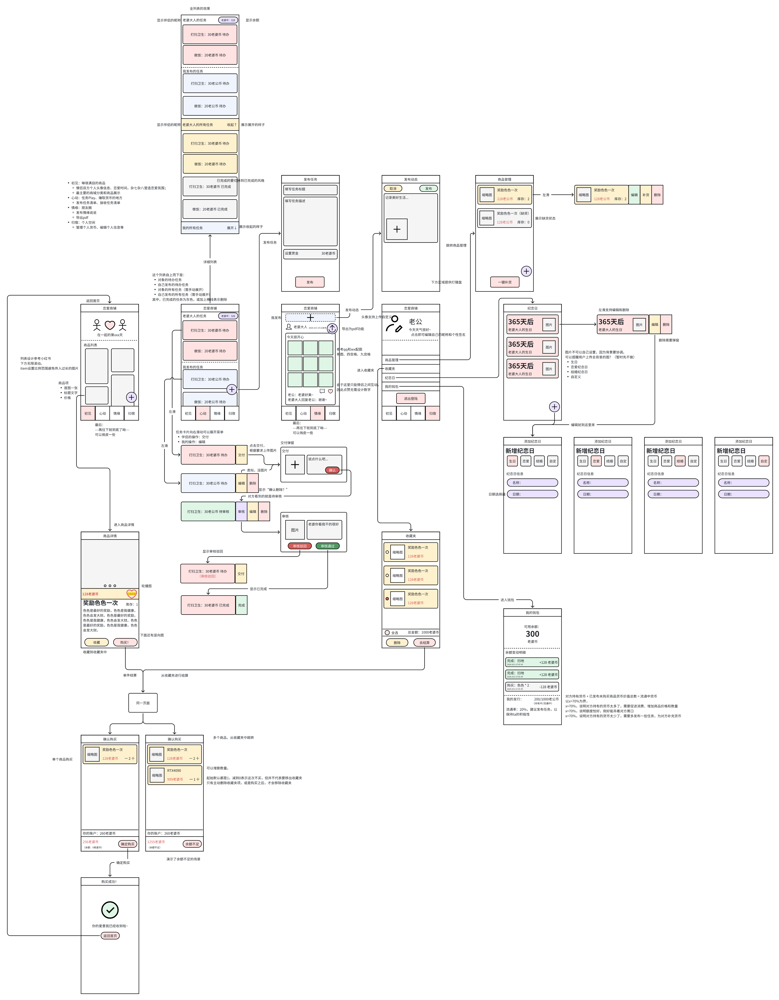

# 项目简介 《恋爱商铺》，Lover Shop

本项目旨在为情侣们提供一个充满乐趣的平台，通过增进彼此间的互动和情感联系来丰富他们的恋爱生活。用户可以通过微信轻松注册账户并建立情侣关系，随后在平台上发布一系列有趣的爱情任务。完成这些任务后，情侣们可以赚取专属货币，并用这些货币来兑换对方提供的各类服务或惊喜。本平台以娱乐为核心，致力于让每一对情侣的恋爱之旅更加甜蜜和难忘。

## 项目受众分析

1. **年轻情侣**
	1. **年龄段**：主要集中在18-35岁之间。
	2. **特点**：追求新鲜感和趣味性，喜欢尝试新事物，注重情感交流和互动。
	3. **需求**：希望在恋爱生活中增添更多乐趣和惊喜，增进彼此的感情。
2. **异地恋情侣**
	1. **特点**：由于地域限制，无法经常见面，需要更多的线上互动来维持感情。
	2. **需求**：通过平台提供的远程互动任务和服务，弥补不能见面的遗憾，保持恋爱的新鲜感。
3. **已婚夫妇**
	1. **年龄段**：可能覆盖更广泛的年龄层，但主要集中在25-45岁之间。
	2. **特点**：已经步入婚姻生活，面临日常琐事的挑战，需要寻找新的共同兴趣点和情感连接方式。
	3. **需求**：希望通过有趣的任务和活动，重新点燃爱情的火花，增强夫妻间的情感纽带。

## 技术选型

在技术选型上，本项目将充分利用我所掌握的技术栈，以确保项目的快速迭代和高效上线。同时，我们将紧密关注用户使用习惯，力求为用户提供便捷、流畅的使用体验。

前端方面，我们计划采用微信小程序作为主要开发平台。微信小程序具有广泛的用户基础和便捷的访问方式，能够轻松融入用户的日常生活。通过微信小程序，用户可以随时随地访问我们的平台，享受丰富的恋爱互动功能。

后端方面，我们将采用Spring Boot框架来搭建后端服务。Spring Boot以其简化的配置和快速的开发周期而闻名，能够大大提高我们的开发效率。同时，Spring Boot还具有良好的扩展性和稳定性，能够满足我们项目未来的发展需求。

在数据存储方面，我们将使用MySQL数据库进行数据存储。MySQL作为一种成熟、稳定的关系型数据库管理系统，能够为我们提供高效的数据存储和查询服务。通过合理的数据库设计，我们将确保数据的完整性和一致性，为平台的稳定运行提供有力保障。

综上所述，我们将采用微信小程序、Spring Boot和MySQL等技术来构建本项目。这些技术的选用不仅符合我们的技术能力和项目需求，还能够契合用户的使用习惯，为用户提供优质的恋爱互动体验。

# 软件设计

## 页面设计

那么，现在，就开始开发吧！

